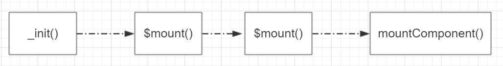
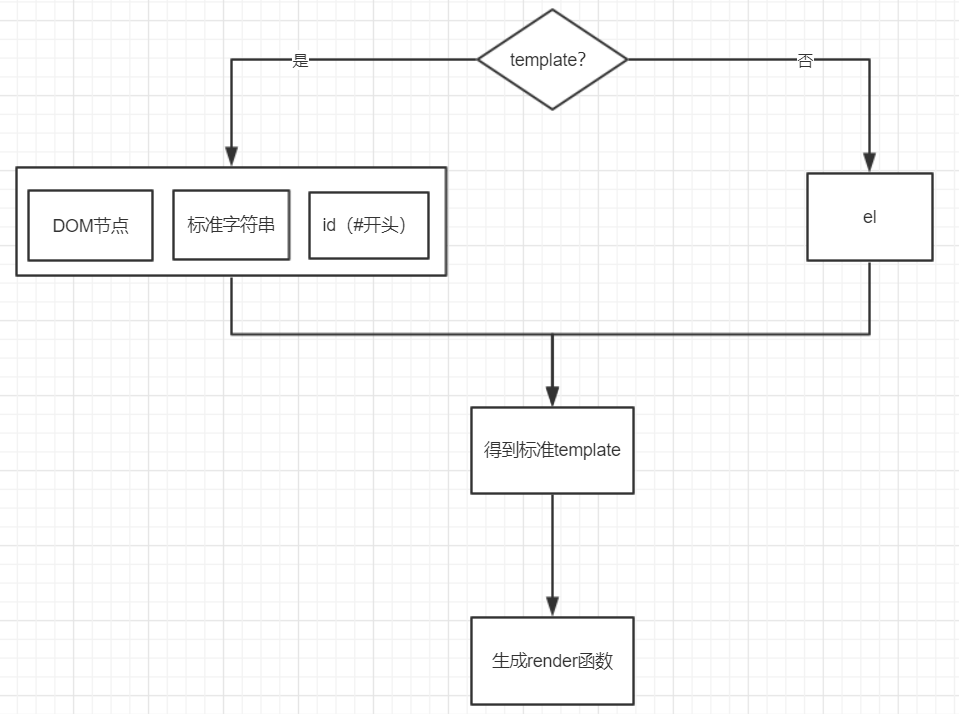

### vue初始化渲染
本节讨论vue是如何将一个普通的html标签渲染到页面上的。
现在，要让页面上出现如下一个div标签：
```html
<div id="app2" class="container">hello</div>
```
按照vue的语法，我们将上面的div标签写成如下render函数。
```javascript
  render(h) {
    return h('div', {
      attrs: {
        id: 'app2',
        class:'container'
      }
    }, this.msg)
  }
```
或者使用jsx语法，如下：
```javascript
  render(h) {
    return <div id="app2" class="container">{this.msg}</div>
  }
```
初始化vue时，传入下面这个对象。
```javascript
new Vue({
  name: 'main',
  el: '#app',
  data() {
    return {
      msg: 'hello'
    }
  },
  render(h) {
    return h('div', {
      attrs: {
        id: 'app2',
        class:'container'
      }
    }, this.msg)
  }
})
```


### 1、总体流程

_init--->$mount--->$mount--->mountComponent
我们来看看vue是如何将一个div一步步渲染到页面中的。
new Vue({})的时候，会执行实例上的_init()方法，源码如下：
```javascript
function Vue (options) {
  if (process.env.NODE_ENV !== 'production' &&
    !(this instanceof Vue)
  ) {
    warn('Vue is a constructor and should be called with the `new` keyword')
  }
  this._init(options)
}
```
_init方法执行了很多的逻辑，本节只讲解和我们本次目的有关的。简化后的_init如下：
```javascript
//
vm._uid = uid++
vm._isVue = true
//
vm.$options = mergeOptions(
    resolveConstructorOptions(vm.constructor),
    options || {},
    vm
)
//
if (process.env.NODE_ENV !== 'production') {
    initProxy(vm)
} else {
    vm._renderProxy = vm
}
//
vm._self = vm
//
initLifecycle(vm)
initEvents(vm)
initRender(vm)
callHook(vm, 'beforeCreate')
initInjections(vm) // resolve injections before data/props
initState(vm)
initProvide(vm) // resolve provide after data/props
callHook(vm, 'created')
//
if (vm.$options.el) {
    vm.$mount(vm.$options.el)
}
```
**_init概况起来主要工作就是以下几个**：
- 在实例上挂载一些属性，包括唯一标识(_uid)、是否是Vue实例(_isVue)、对自身的引用(_self)
- 处理参数。为后续初始化等工作做准备
- 代理数据到实例上
- 初始化实例。也就是给实例原型上添加各种类型的方法，包括生命周期相关的、事件相关的、渲染相关的等等。
- 将实例挂载到页面。也就是将数据按照规则渲染到页面上
#### 1-1、处理参数
mergeOptions合并参数
#### 1-2、初始化属性、方法、数据等
initState(vm)方法，初始化props、methods、data、computed、watch。
initState的代码如下：
```javascript
export function initState (vm: Component) {
  vm._watchers = []
  const opts = vm.$options
  if (opts.props) initProps(vm, opts.props)
  if (opts.methods) initMethods(vm, opts.methods)
  if (opts.data) {
    initData(vm)
  } else {
    observe(vm._data = {}, true /* asRootData */)
  }
  if (opts.computed) initComputed(vm, opts.computed)
  if (opts.watch && opts.watch !== nativeWatch) {
    initWatch(vm, opts.watch)
  }
}
```
##### 1-2-1、代理数据到实例上
initData(vm)将vm.$options.data上的数据代理到了实例上，换句话说就是在实例上也能访问data上的属性。
如何实现数据代理呢，这里展示两种方法
##### 1-2-1-1、利用Object.defineProperty
```javascript
let data = {
    name: 'wz',
    location: 'beijing',
    job: 'The end of front'
}
let vm = {}
function proxy(target, source) {
    Object.keys(source).forEach(key => {
        Object.defineProperty(target, key, {
            get() {
                return source[key]
            }
        })
    })
}
vm = proxy(vm, data)
console.log(vm.name)
```
data是原始数据，即被代理数据；vm是代理者，就是说要实现的效果是，当访问vm上的某个属性时，需要返回data上该属性的值。
比如，需要访问vm.name，这时应该返回data.name。因为 Object.defineProperty方法能够拦截属性的**获取**和**设置**操作，
所以就它提供了一种机制，能让我们去改写这种默认行为。
##### 1-2-1-2、利用Proxy
```javascript
let data = {
    name: 'wz',
    location: 'beijing',
    job: 'The end of front'
}
let vm = {}
let vm_p = new Proxy(vm, {
        get(target, key, receiver) {
            // Reflect.get(target, key, receiver);
            return Reflect.get(data, key, receiver)
        }
    })
console.log(vm_p.name)
```
Proxy同样可以拦截属性的**获取**和**设置**操作。
其实，只要实现一种能够拦截属性的**获取**和**设置**机制，就能做到代理数据、双向绑定等功能。
源码中关于代理数据的实现如下：
```javascript
export function proxy (target: Object, sourceKey: string, key: string) {
  sharedPropertyDefinition.get = function proxyGetter () {
    return this[sourceKey][key]
  }
  sharedPropertyDefinition.set = function proxySetter (val) {
    this[sourceKey][key] = val
  }
  Object.defineProperty(target, key, sharedPropertyDefinition)
}
```
### 2、$mount:
1、根据el获取dom，判断获取到的dom是否是body或documentElement,如果是就报错。
2、获取template，然后生成render函数，合并到$options上
3、处理完毕，交给原有$mount函数。
#### 2-1、校验el，也就是校验挂载点是否合法
这里对el挂载点做了一层校验，el不能为body或documentElement,因为vue中最后生成的DOM树是替换掉了el，而不是挂载到el上。
```javascript
  if (el === document.body || el === document.documentElement) {
    process.env.NODE_ENV !== 'production' && warn(
      "Do not mount Vue to <html> or <body> - mount to normal elements instead."
    );
    return this
  }
```
#### 2-2、获取template
vue在实例化的时候，是必须要确定render函数的，而render函数可以是用户手动传入，也可以是从template编译而来的。
如果是从template编译而来的话，那么对template的格式就有一写要求，也就是template只能是以下这几种形式之一，否则template
不合法。

如上图所示，template只能是以下几种形式
- DOM节点，也就是通过原生方法获取到的节点
- 标准字符串，比如：\<div>{{msg}}\</div>
- id,比如，"#app",vue内部会根据这个id获取DOM。
- 没有传template的情况下，vue会根据el的值去获取template
### 3、$mount:
1、再次判断el值，浏览器环境下的话，交由query处理，否则el为undefined
2、处理完毕，交给mountComponent处理
再次判断el，源码如下：
```javascript
Vue.prototype.$mount = function (
  el,
  hydrating
) {
  el = el && inBrowser ? query(el) : undefined;
  return mountComponent(this, el, hydrating)
};
```
### 4、mountComponent:
1、vm.$el=el
2、验证vm.$options.render是否为合法值。
3、调用beforeMount生命周期函数
4、updateComponent = function () {
      vm._update(vm._render(), hydrating);
    };
5、实例化Watcher，将updateComponent函数传入Watcher构造函数。


1、数据代理
2、观察者模式new Watcher
3、装饰器模式 $mount调用mount,mount调用mountComponent,这种一层层调用，每个方法先缓存原函数，然后处理一些情况，最后再调用已经缓存的原函数，类似装饰器模式
4、virtualDOM其实就是一个对象，该对象其实就是对真实dom的一种描述。
5、利用函数柯里化抹平平台差异化，为后续工作提供便利。
6、插入节点时，采用递归遍历，先插入子节点，后插入父节点。
7、调用DOM原生api插入元素


